# struktur-data-h-praktikum-2-2021

## Nadut Belajar

### Verdict

AC saat praktikum

#### Bukti

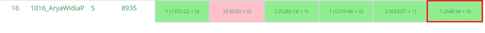

### Penjelasan Soal

Diberikan beberapa bilangan yang akan disusun menjadi AVL Tree. Lalu, dilakukan input berupa bilangan yang dicari selisih antara `parent`nya dengan `sibling` dari `parent`nya. Lalu, dikeluarkan output berupa `selisih` tersebut. Jika bilangan yang dicari terdapat pada `root`, dikeluarkan `0`.

### Penjelasan Solusi

Persoalan diselesaikan dengan AVL Tree. Implementasi AVL Tree yang digunakan kali ini menggunakan node yang memiliki member `data`, `left`, dan `right`. Oleh karena itu, penyelesaian dapat dilakukan dengan bantuan 3 pointer. `p3` menunjuk pada node dengan `data` sesuai dengan bilangan yang diinput, `p2` menunjuk `parent` dari node tersebut, dan `p1` menunjuk `parent` dari `parent` tersebut agar kita dapat mengakses `sibling` dari `parent`.

Pertama, buat sebuah AVL Tree bernama `myAVL` dan inisialisasi dengan `avl_init`. Lalu, buat variabel `Q` untuk menyimpan banyak bilangan yang ingin diinput ke tree, `T` untuk menyimpan banyak bilangan yang akan dicari, `tmp` untuk mengambil bilangan yang ingin diinput, dan `X` untuk mengambil bilangan yang akan dicari.

Lalu, diambil input untuk `Q` dan`T`.
Selanjutnya, dilakukan loop sebanyak `Q` kali untuk memasukkan bilangan ke tree (`avl_insert`). Kemudian, dilakukan loop sebanyak `T` kali untuk mendapatkan input untuk `X` dan mendapatkan selisih antara `parent` dari `X` dengan saudaranya (fungsi `searchDif`).

Fungsi `searchDif` menerima parameter pointer ke `AVLNode` (`root`), yaitu akar dari AVL Tree, dan `int` (`value`), yaitu nilai yang dicari. Di dalamnya, pertama, diinisialisasi tiga pointer, `p1`, `p2`, dan `p3`, menunjuk ke `root`. Kemudian, dibuat suatu variabel `depth` bernilai 1. Fungsinya adalah untuk mentrack `p3` menunjuk ke node tingkat berapa. Dengan demikian, `p1` dan `p2` dapat dipindah dengan sesuai.

Selanjutnya dilakukan loop yang akan berhenti saat `p3` bernilai `NULL` atau saat `p3` menyimpan data sesuai nilai yang diminta.

> Pada `depth == 1`, menandakan `p3` ada di root, sehingga `p1` dan `p2` belum perlu dipindah. Ketika `depth > 1` menandakan `p3` ada ditingkat kedua, dan jika belum merupakan bilangan yang dicari, `p2` sudah berpindah menjadi `p3`, karena `p3` akan diubah nilainya menjadi child dari `p3` itu sendiri. Hal yang sama terjadi saat `depth > 2` pada `p1` dengan `p2`, di mana `p1` akan pindah ke posisi `p2`.

Jika nilai ditemukan, dikeluarkan output seperti berikut:

- Kalau `p3` adalah `root` keluarkan `0`.
- Kalau `p2` adalah `root` (parent dari node yang dicari), keluarkan nilai yang disimpan pada node yang ditunjuk `p2`, karena `root` tidak memiliki *sibling*.
- Di luar kondisi di atas:
  - Kalau `p1` hanya memiliki satu `child`, keluarkan nilai yang disimpan oleh node `p2`.
  - Kalau tidak, keluarkan selisih dari `p1->right->data` dengan `p1->left->data`.

### Visualisasi Solusi

Untuk mempermudah visualisasi solusi dari permasalahan Nadut Belajar, digunakan sample input berikut:

```c
6 1
7 10 21 45 30 29
7
```

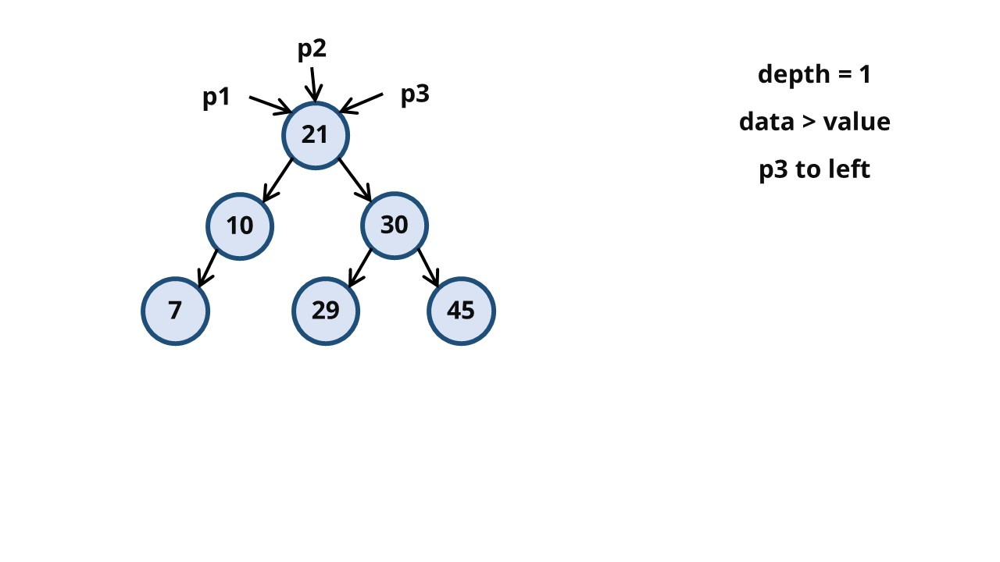

Semua pointer start di root.

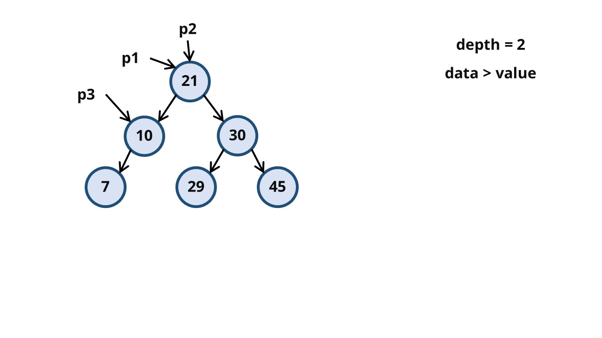

Karena data dari node yang ditunjuk p3 lebih besar dari value, geser p3 ke kiri node. depth + 1.

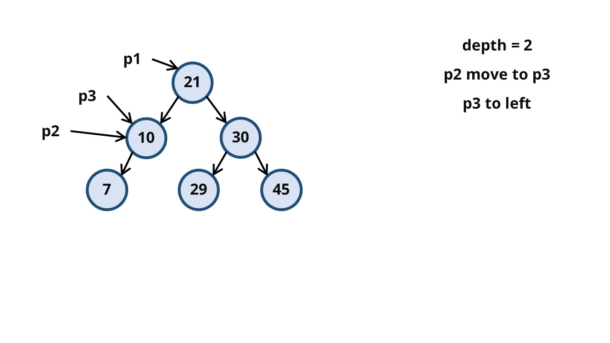

`p3` belum menunjuk node yang sesuai dan depth > 1, p2 pindah ke p3.

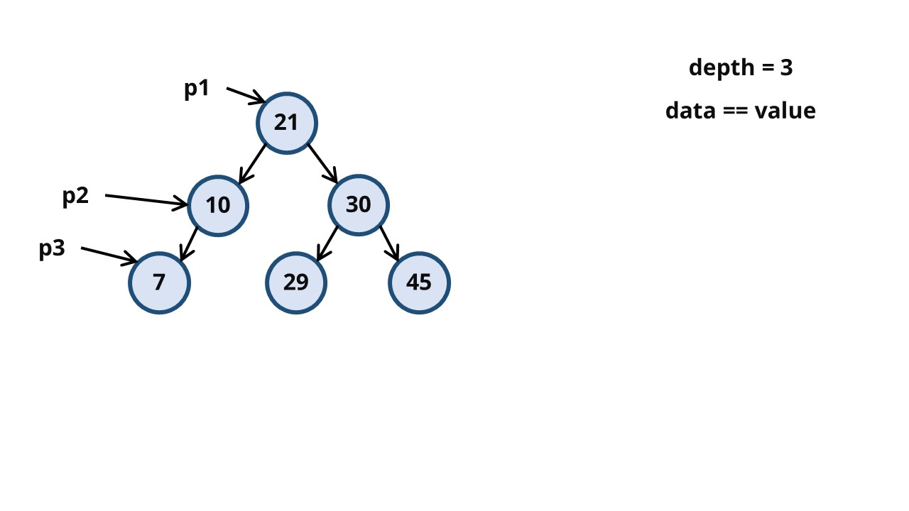

Karena data dari node yang ditunjuk p3 lebih besar dari value, geser p3 ke kiri node.


Node yang ditunjuk p3 memiliki nilai yang dicari, sehingga cetak selisih dari anak-anak node yang ditunjuk p1.

Output:

```c
20
```

## Bucyn

### Verdict

AC saat praktikum

#### Bukti

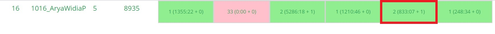

### Penjelasan Soal

Diminta untuk menyusun kaset episode drakor dengan sistem penumpukannya seperti AVL Tree.

Jika input adalah `Taro` dan sebuah bilangan, berarti masukkan kaset episode tersebut ke tumpukan.

Jika input adalah `Cari` dan sebuah bilangan, berarti cari tahu kaset ada di tumpukan berapa. Jika kaset ditemukan, keluarkan `Kasetnya ada di tumpukan ke - n` dengan n adalah posisi kaset di tumpukan. Jika kaset tidak ditemukan. keluarkan `Kasetnya gak ada!`.

Jika input tidak sesuai dengan kedua input di atas, keluarkan `AKU TUH GATAU HARUS NGAPAIN!`.

### Penjelasan Solusi

Masalah Bucyn dapat diselesaikan dengan traversal inorder dengan operasi yang dilakukan adalah meng-*increment* suatu variabel penghitung. Melalui contoh output yang diberikan pada sample case, dapat dilihat bahwa kaset akan berada pada tumpukan ke-n, dengan n adalah urutan bilangan jika dilakukan traverse inorder.

Dengan demikian, dibuat suatu fungsi `inorder_order` yang menerima parameter `AVLNode *root`, `int *count`, `int query`, dan `bool *isFound`:

- `*count` untuk menghitung pada urutan ke berapa nilai yang dicari.
- `query` untuk menyimpan nilai yang dicari.
- `*isFound` untuk mengetahui apakah nilai sudah ditemukan, sehingga dapat kembali "secara langsung" ke fungsi utama.

Fungsi `inorder_order` setelah menerima parameter, akan mengecek apakah `root` itu ada. Jika iya, dilakukan pemanggilan ke `inorder_order` dengan mengirimkan parameter `root->left` daripada `root`. Kemudian, setelah pemanggilan tersebut selesai dilakukan, jika `root->data==query` (data ditemukan), ubah `isFound` menjadi `true`, dan `return`. Jika `root` tidak menyimpan data yang diinginkan, *increment* `*count` dengan 1. Lalu, lakukan juga pemanggilan fungsi `inorder_order`dengan `root->right`.

Di dalam fungsi `main`, diinisialisasi `AVL Tree` bernama `myAVL`. Kemudian, diinisialisasi juga pointer bertipe `AVLNode` yaitu `pAvl`.
Lalu, dibuat variabel integer `T` untuk menyimpan banyak testcase dan `I` untuk mengambil bilangan yang ingin dimasukkan/dicari ke/di `AVL Tree`. Lalu, diambil input untuk `T`. Selanjutnya, dilakukan loop sebanyak `T` kali.
Di dalam loop, dibuat `array of char` bernama `cmd`. Lalu, diambil input untuk `cmd` dan `I`.

- Jika `cmd` adalah `"Taro"`, masukkan nilai `I` ke dalam `AVL Tree`.
- Jika `cmd` adalah `"Cari"`, cari `I` menggunakan fungsi `_search` dan simpan nilai kembalinya ke `pAvl`. Jika nilainya ada, inisialisasi integer `order` dengan `1` dan boolean `check` dengan `false`, lalu panggil fungsi `inorder_order`.

  ```c
  inorder_order(myAvl._root, &order, I, &check);
  ```

  Kemudian, keluarkan `Kasetnya ada di tumpukan ke - order`.
  
  Jika nilainya tidak ada, keluarkan `Kasetnya gak ada!`.
- Jika `cmd` tidak sesuai dengan kedua nilai di atas, keluarkan `AKU TUH GATAU HARUS NGAPAIN!`.

### Visualisasi Solusi

Untuk mempermudah visualisasi solusi dari permasalahan Bucyn, digunakan sample input berikut:

```c
7
Taro 100
Taro 74
Cari 100
Taro 152
Taro 21
Taro 33
Cari 100
```

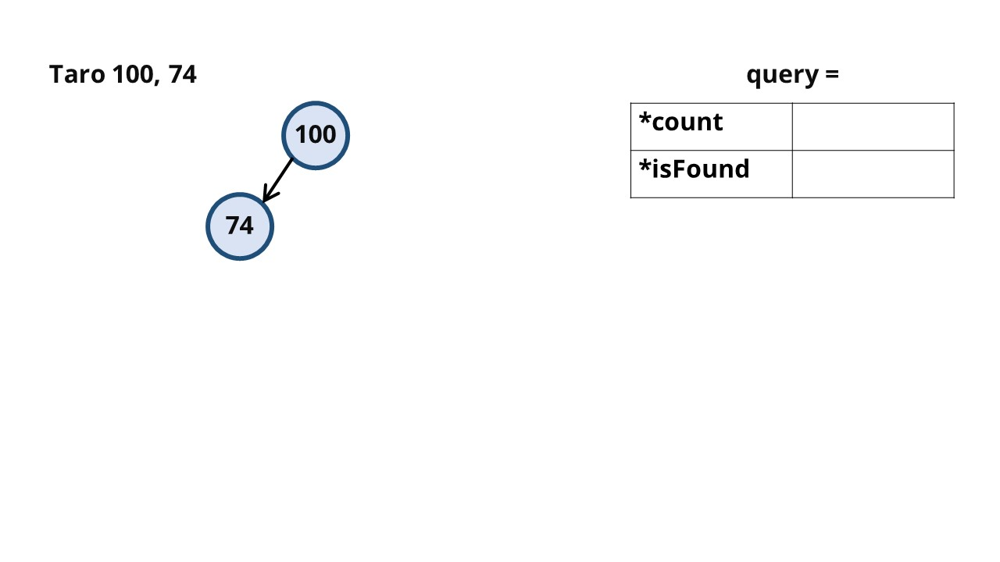

Masukkan 100 dan 74 (command `Taro`)

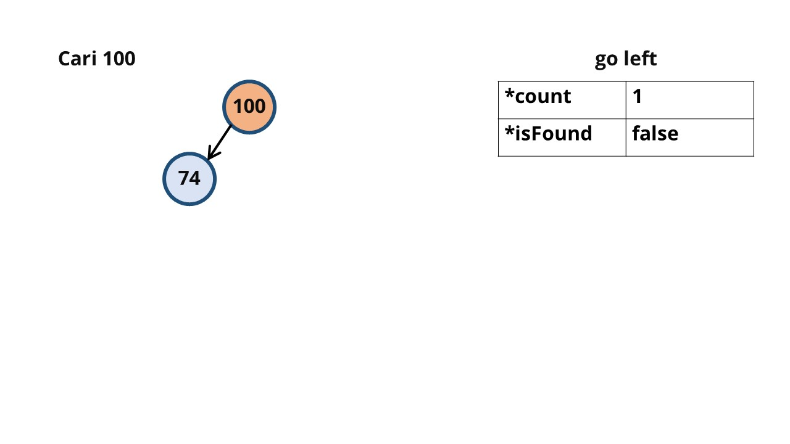

Mencari nilai tumpukan 100. Karena inorder, dari root ke node kiri terlebih dahulu.

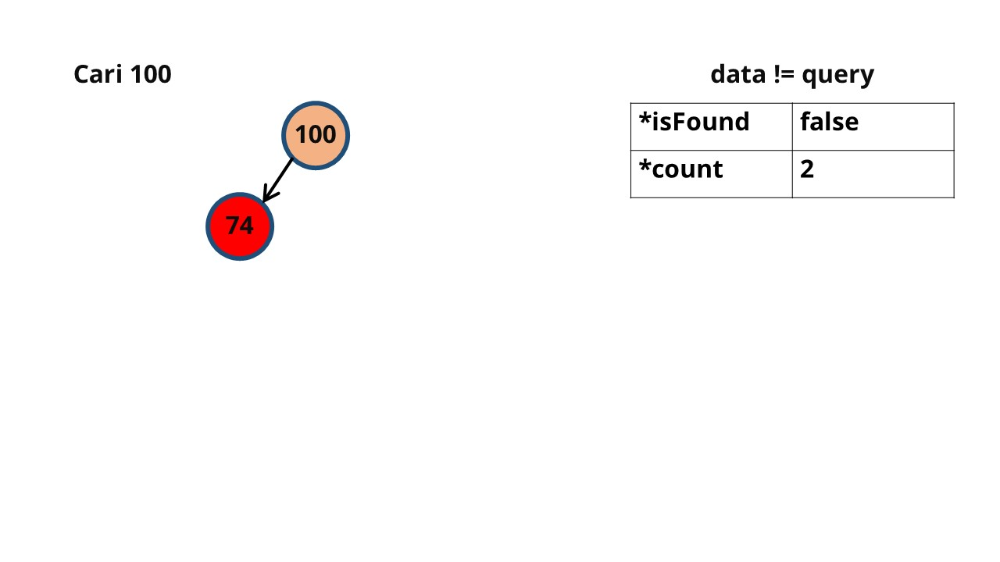

Nilai node tidak sesuai dengan yang diminta, sehingga *count + 1. Kanan node tidak ada, kembali ke parent node.

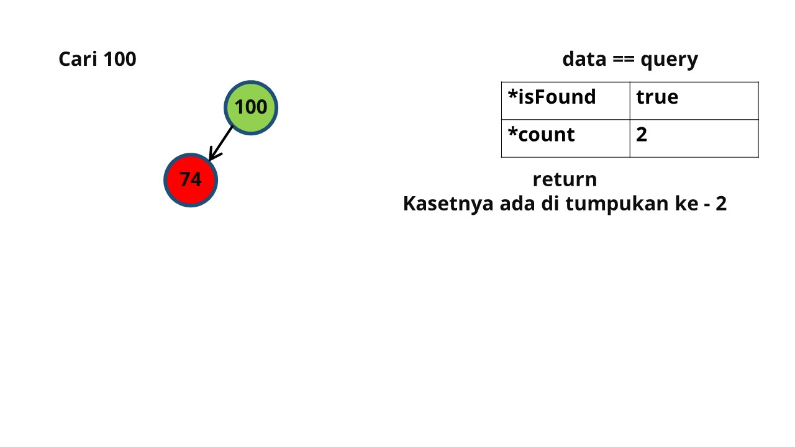

Nilai node merupakan yang diinginkan. return, dan program main mencetak `Kasetnya ada di tumpukan ke - 2`

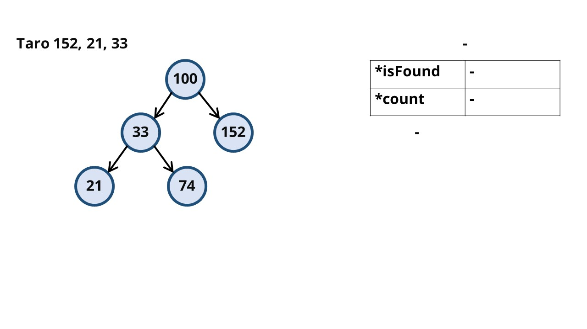

Masukkan 152, 21, dan 33 (command `Taro`)

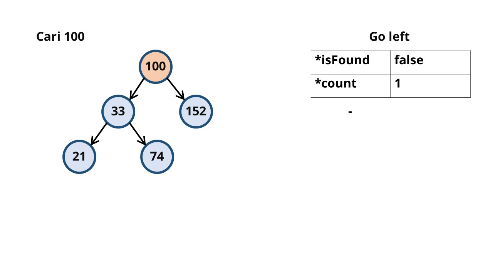

Cari 100. Telusur ke kiri dahulu.

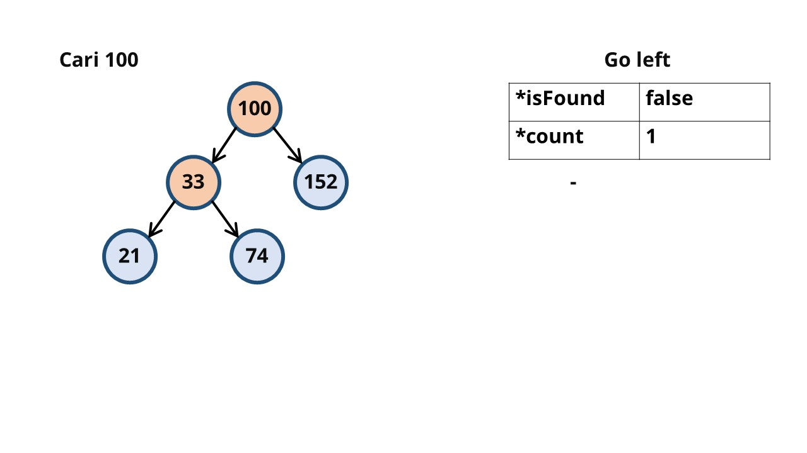

Telusur ke kiri lagi.

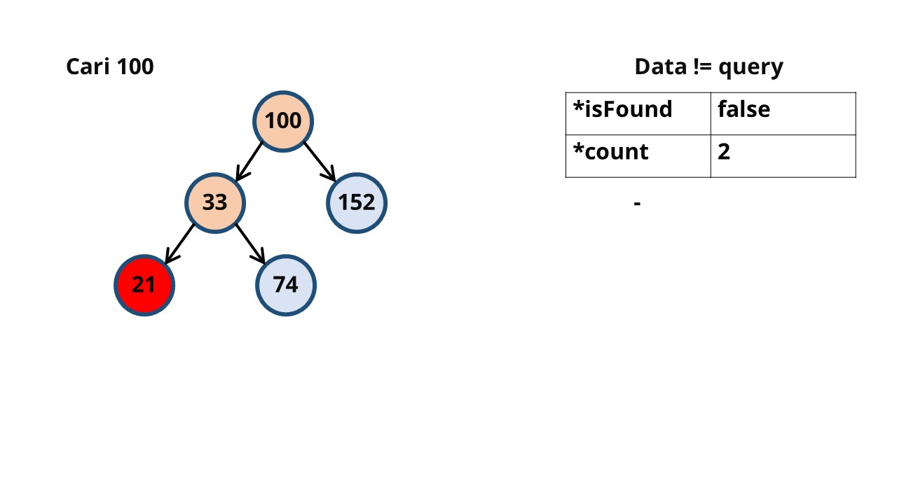

Nilai node tidak sesuai dengan yang diminta, sehingga *count + 1. Kanan node tidak ada, kembali ke parent node.

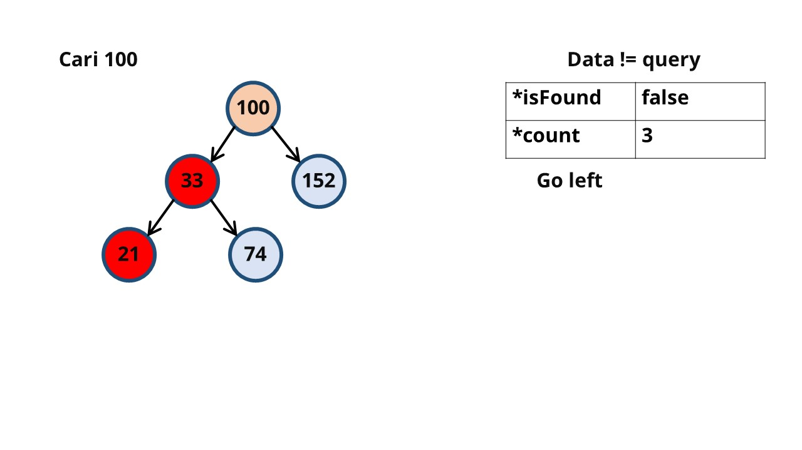

Nilai node tidak sesuai dengan yang diminta, sehingga *count + 1. Lanjut ke kanan node.

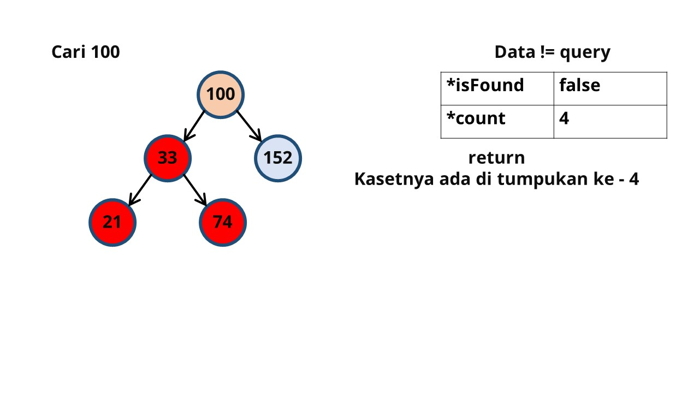

Nilai node tidak sesuai dengan yang diminta, sehingga *count + 1. Kanan node tidak ada, kembali ke parent dari parent node.

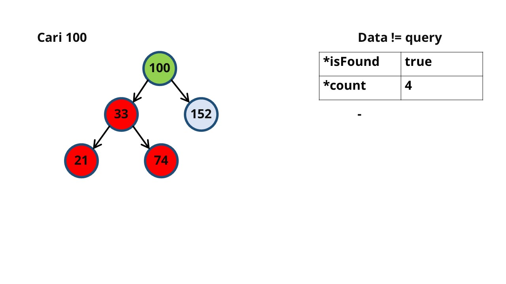

Nilai node merupakan yang diinginkan. return, dan program main mencetak `Kasetnya ada di tumpukan ke - 4`

Output:

```c
Kasetnya ada di tumpukan ke - 2
Kasetnya ada di tumpukan ke - 4
```

## Part Time

### Verdict

AC saat praktikum

#### Bukti

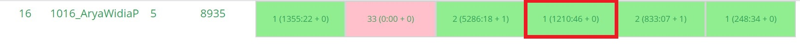

### Penjelasan Soal

Diminta program yang dapat mengarsip barang yang memiliki `id` dan `harga`. Lalu, akan diberikan penjualan pada hari itu berupa jumlah barang dan id barang. Output yang dikeluarkan dalam kondisi yang seharusnya (id terurut dan id dicari ada) adalah `Z`, total pendapatan. Dalam kondisi id tidak terurut saat input, output yang dikeluarkan adalah `ID harus urut` dan program dihentikan. Ketika id barang yang dicari tidak ada, output yang dikeluarkan `Maaf barang tidak tersedia` dan program dilanjutkan.

### Penjelasan Solusi

Penyelesaian masalah Part Time dapat diselesaikan dengan menambahkan member integer `price` ke AVLNode untuk menyimpan harga dari barang. Dengan demikian, fungsi `_avl_createNode`, `_insert_AVL`, dan `avl_insert` ditambahkan parameter `int price`, juga pada `_avl_createNode` ditambahkan `newNode->price = price;` untuk menambahkan harga ke node.

Pertama, inisialisasi sebuah AVL Tree bernama `myAVL`, integer `P` (untuk ID) dan `Z` (untuk menyimpan penjumlahan pendapatan) dengan `0`, dan dibuat integer bernama `M` (banyak ID barang), `N`(banyak jenis barang yang terjual), `Q` (harga barang), `X` (banyak barang yang terjual), `Y` (ID barang yang dicari), dan `temp` (menyimpan sementara input ID). Lalu, ambil input untuk `M` dan `N`. Lalu, dilakukan loop sebanyak `M`.

Di dalam loop:
> Ambil nilai untuk `temp`. Kemudian, uji `temp` apakah sama dengan `p+1`. Hal ini dilakukan untuk menguji apakah ID yang diinput urut. Jika tidak, maka keluarkan `ID harus urut` dan langsung keluar dari program. Jika urut, buat `P=temp`, ambil input harga (`Q`), dan masukkan `P` dan `Q` ke `myAVL` (`avl_insert(&myAVL, P, Q)`).

Kemudian, inisialisasi sebuah pointer bertipe `AVLNode` bernama `p`. Lalu, dilakukan loop sebanyak `N` kali.

Di dalam loop:
> Ambil nilai untuk `X` dan `Y`.
>
> - Jika barang tidak ada (`!avl_find(&myAVL, Y)`), keluarkan `Maaf barang tidak tersedia` dan lanjut ke iterasi berikutnya.
>- Jika barang ada, isi `p` dengan nilai dari fungsi `_search` yang dikirim parameter `myAVL._root` dan `Y`. Lalu, tambahkan `p->price` dikali `X` ke `Z`.

Setelah loop selesai, keluarkan nilai `Z`.

### Visualisasi Solusi

Untuk mempermudah visualisasi solusi dari permasalahan Part Time, digunakan sample input berikut:

```c
5 5
1 13000
2 5500
3 8750
4 21900
5 30000
4 4
2 3
2 1
1 7
3 2
```


Modifikasi node untuk menyimpan harga.


Masukkan semua input ke dalam tree.

Y = 4, Cari 4. Hasilnya true sehingga lanjutkan operasi dalam loop.

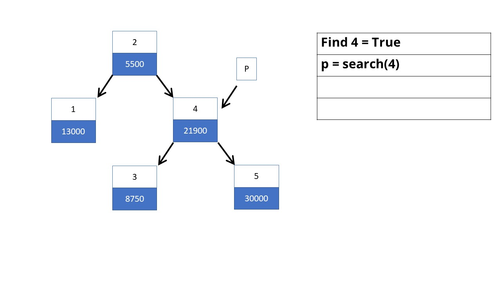

Ambil node yang memiliki ID = 4 dengan fungsi `_search`, simpan pada pointer p.

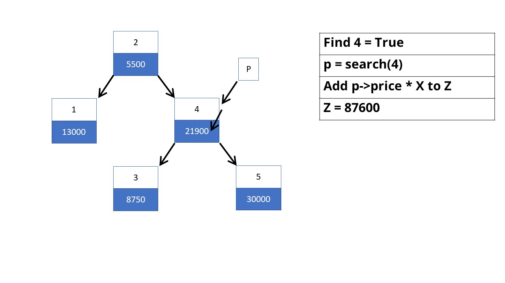

Lalu, kalikan p->price dengan X, lalu tambahkan ke Z.


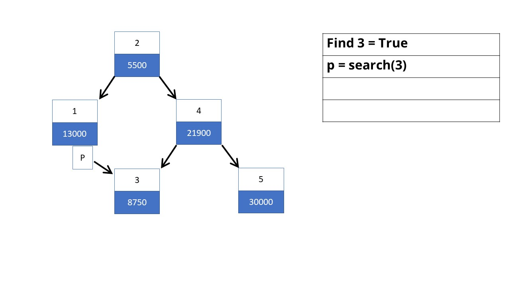
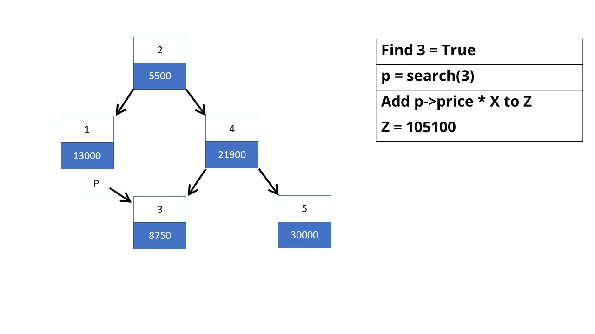
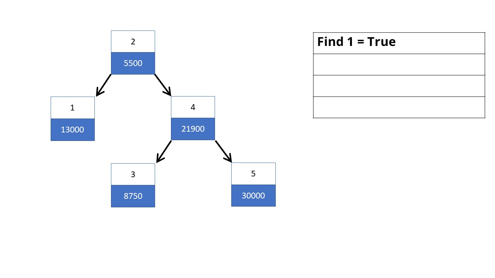
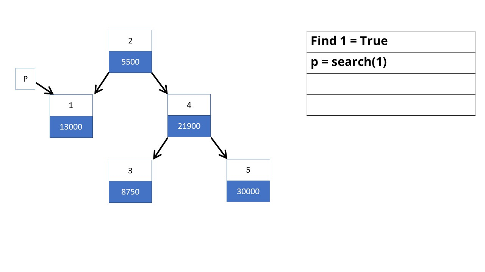
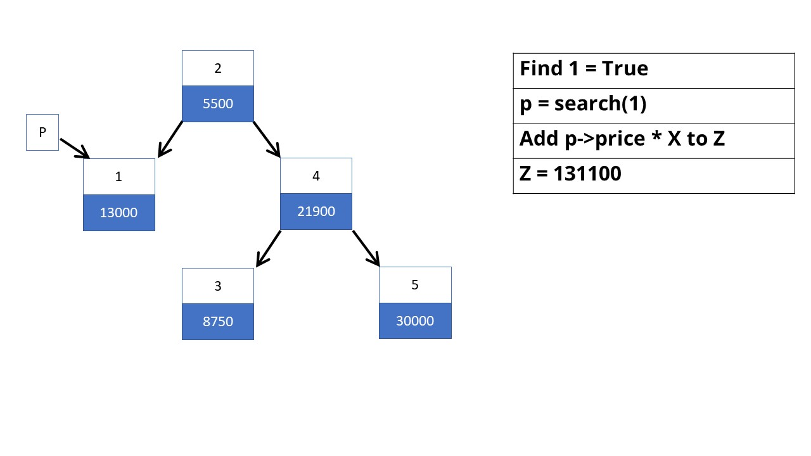

Untuk dua input selanjutnya, sama seperti input di atas karena IDnya ada.

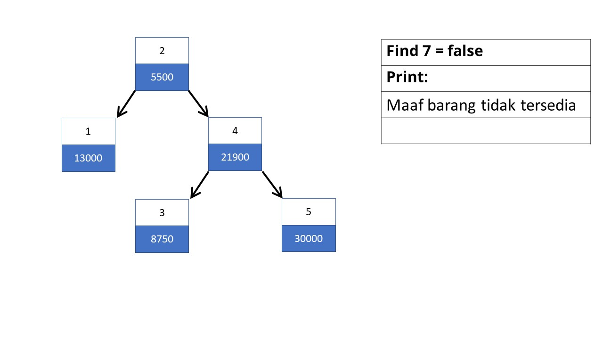

Y = 7. Karena tidak ada barang dengan ID 7, keluarkan `Maaf barang tidak tersedia`


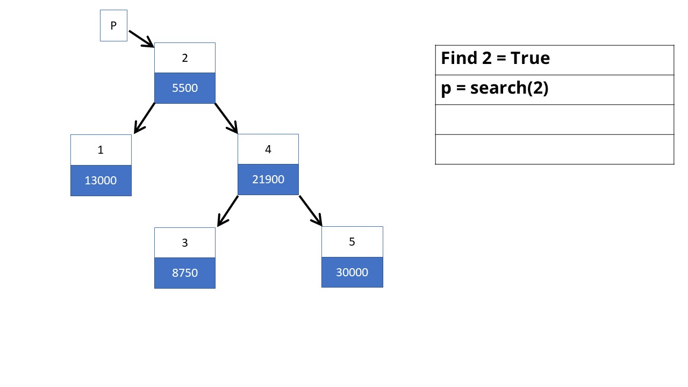
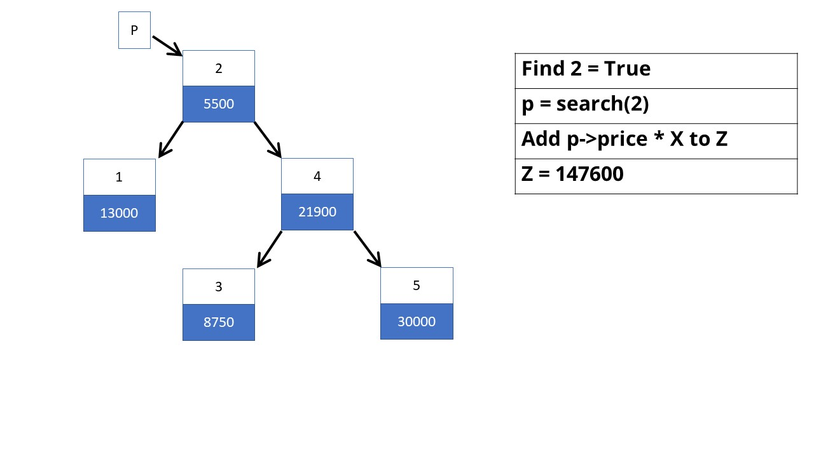

Y = 2. Barang dengan ID 2 ada, sehingga harganya ditambahkan ke Z

Terakhir, cetak Z.

Output:

```c
Maaf barang tidak tersedia
147600
```

## Kata-Kata

### Verdict

AC saat praktikum

#### Bukti

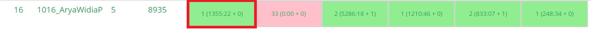

### Penjelasan Soal

Diminta program yang dapat menyimpan `n` kata dan dapat mencari kata sebanyak `q`. Output yang dihasilkan adalah `1` jika kata yang dicari tersimpan dan `0` jika kata yang dicari bukan merupakan kata yang tersimpan.

### Penjelasan Solusi

Penyelesaian masalah Kata-Kata, digunakan struktur data `Trie`, yang dapat menyimpan data kata lebih efisien. Struktur data `Trie` adalah pengembangan dari `Tree`, tetapi yang disimpan bukan `data`, melainkan `array of pointer`. Index dari `Array of pointer` ini menandakan karakter apa yang "disimpan". Sebagai contoh, karena soal memberikan kata yang terdiri atas `a-z` (huruf kecil), index 0 menandakan huruf `a`, dan index 25 menandakan huruf `z`.

Pertama, diinisialisasi sebuah pointer `TrieNode` bernama `root` yang akan menjadi akar dari struktur `Trie`. Lalu, dibuat integer `n` (untuk ) dan `q` (untuk ), dan *array of char* bernama `str`.
Selanjutnya, terima input untuk `n` dan lakukan loop sebanyak `n` kali. Dalam loop, terima input untuk kata yang akan dimasukkan ke Trie dengan `str` dan masukkan ke dalam Trie (`insert(root, str)`).

Selanjutnya, terima input untuk `q` dan lakukan loop sebanyak `q` kali. Di dalam loop, ambil input kata yang akan dicari dengan `str`, lalu cari dengan fungsi `search` (`search(root, str)`). Jika ditemukan, keluarkan `1`. Jika tidak, keluarkan `0`.

### Visualisasi Solusi

Untuk mempermudah visualisasi solusi dari permasalahan Kata-Kata, digunakan sample input berikut:

```c
3
soalnya
mudah
dipahami
3
dan
soalnya
singkat
```

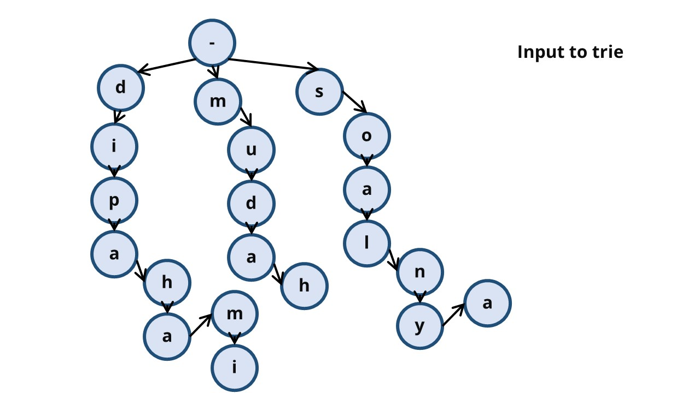

Hasil input data pada trie.


Mencari "dan", dimulai dari node root.

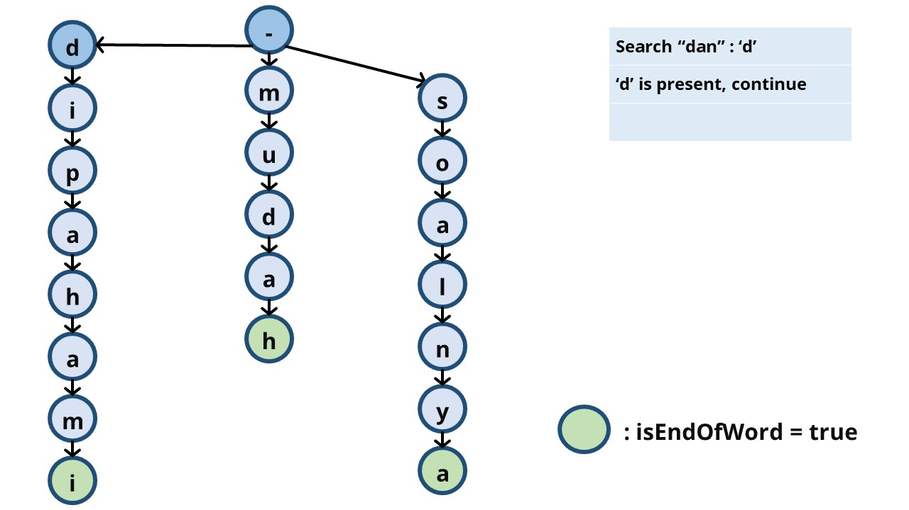

Cek apakah node root punya child node untuk karakter 'd'. Karena ada, lanjut cek ke karakter berikutnya.

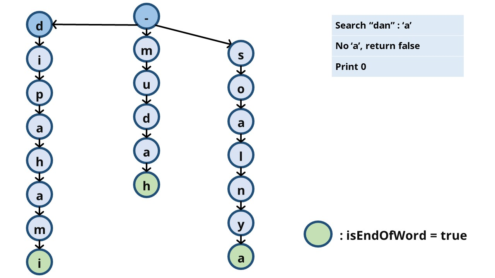

Cek apakah node 'd' punya child node untuk karakter 'a'. Karena tidak ada, hentikan pencarian dan return false. Karena fungsi main menerima false, print `0`.

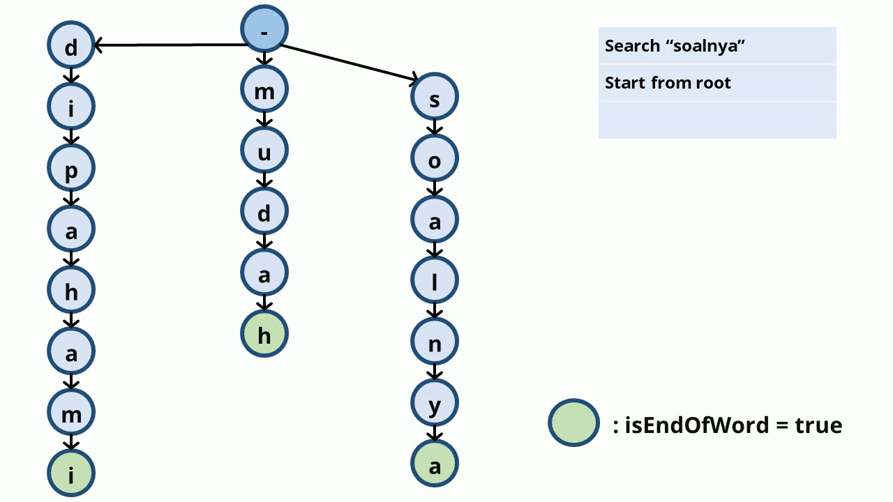

Mencari "soalnya". Tiap karakter dalam kata "soalnya" ditemukan dalam rangkaian node. Terakhir, karakter 'a' merupakan karakter terakhir dari "soalnya" sehingga cek isEndOfWord pada node yang menyimpan karakter 'a'. Karena nilainya true, fungsi search akan mengembalikan nilai true ke fungsi main dan di print `1` melalui fungsi main.


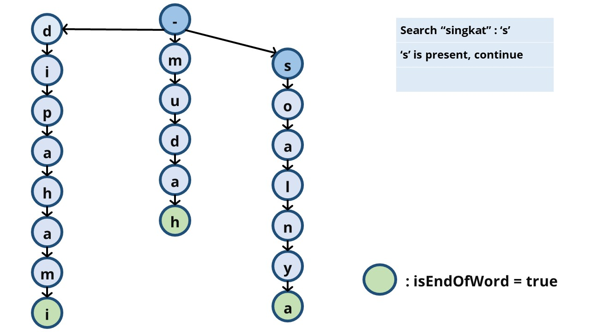
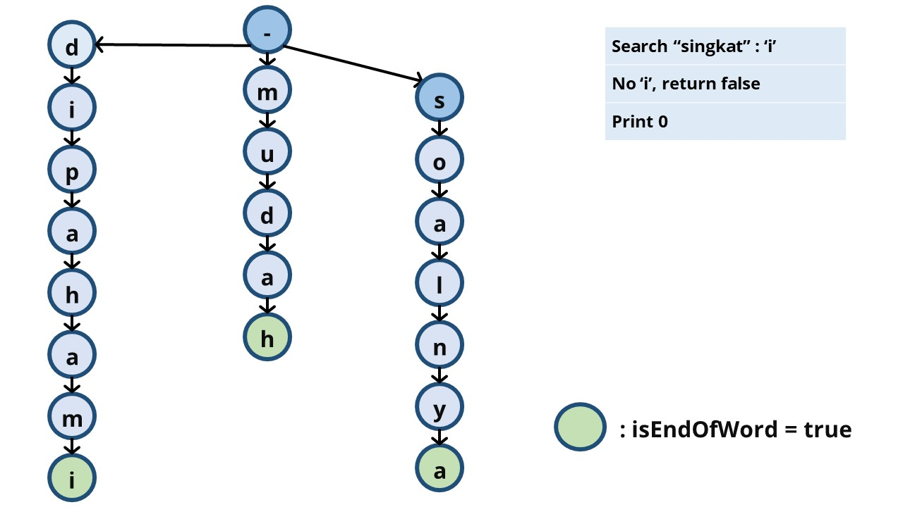

Mencari "singkat". Mirip dengan pencarian "dan", pencarian berhenti di karakter kedua ('i') karena tidak terdapat node children yang melambangkan karakter tersebut. Dengan demikian, dikembalikan nilai false dan fungsi main melakukan print `0`.

Output:

```c
0
1
0
```

## Cayo Niat

### Verdict

AC saat revisi

#### Bukti

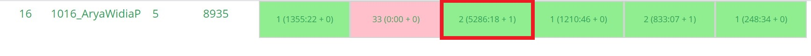

### Penjelasan Soal

Diminta program untuk menerima input kata-kata yang berantakan (terdapat spasi yang panjangnya tidak teratur di antara kata) dan ada beberapa kata yang diulang, lalu dikeluarkan output berupa kata-kata berurutan A-Z-a-z ditambah numbering di depannya dan 1 line selanjutnya berupa kata-kata yang diurutkan, tetapi di antara kata diisi `--<3--`.

### Penjelasan Solusi

Masalah Cayo Niat dapat diselesaikan dengan melakukan loop sampai `EOF` untuk menginput data ke AVL Tree dan melakukan traversal inorder untuk mengeluarkan output.

Agar AVL Tree dapat menyimpan string, data pada `AVLNode` tipenya diubah menjadi `array of char` dan dilakukan penyesuaian pada fungsi lainnya (mengganti *assigment* dan *comparation* dengan `strcmp`). Karena fungsi `avl_insert` hanya akan memasukkan kata jika tidak ada dalam tree, masalah kata yang dapat ditulis berkali-kali terselesaikan.

Fungsi `inorder` menerima parameter `AVLNode *root` (menerima alamat node) dan `int *index` (menerima alamat integer yang akan dipakai untuk menghitung urutan anggota tree). Fungsi ini melakukan traversal inorder dengan operasi yang dilakukan adalah meng*increment* nilai `*index`, lalu mengeluarkan nilai `*index` + `". "` + `root->data` (string yang disimpan pada node).

Fungsi `inorderluv` menerima parameter sama seperti fungsi `inorder` dan juga melakukan traversal inorder. Melalui *sample case* dapat dilihat setiap string diawali `--<3--`, kecuali string yang pertama. Oleh karena itu, pada fungsi `inorderluv`, terdapat `if` untuk mengecek apakah `*index > 0`. Jika iya, barulah diprint `--<3--`. Lalu, keluarkan string yang terdapat pada node (`root->data`). Kemudian, `increment` `*index`.

Di dalam fungsi `main`:

Pertama, inisialisasi sebuah AVL Tree bernama `avlku` untuk menyimpan data. Kemudian, buat sebuah `array of char` bernama `str`. Kemudian, buat sebuah loop yang akan berhenti jika input adalah `EOF` (`while(scanf("%1000s", str) != EOF)`). Di dalam loop, nilai `str` dimasukkan ke `avlku` menggunakan fungsi `avl_insert` (pengambilan input dilakukan dalam *test expression* dari loop). Selanjutnya, diinisialisasi sebuah integer bernama `index` dengan nilai `0`. Selanjutnya, panggil fungsi `inorder` dengan mengirim `avlku._root` dan alamat `index`. Kemudian, `index` di*reset* ke nilai `0`. Lalu, dipanggil fungsi `inorderluv` dengan parameter `avlku._root` dan alamat `index`.

### Visualisasi Solusi

Untuk mempermudah visualisasi solusi dari permasalahan Cayo Niat, digunakan sample input berikut:

```c
Mas      Erki  Guanteng    Poll
 
      Mas     Rifki        Baik Poll
  
 Mba                 Inez  Makan   Cintaku   
 
        Aku    Benci   Soal Banyu
  
CANDA        Mas Daniel    Saranghae Asdos SDH
```

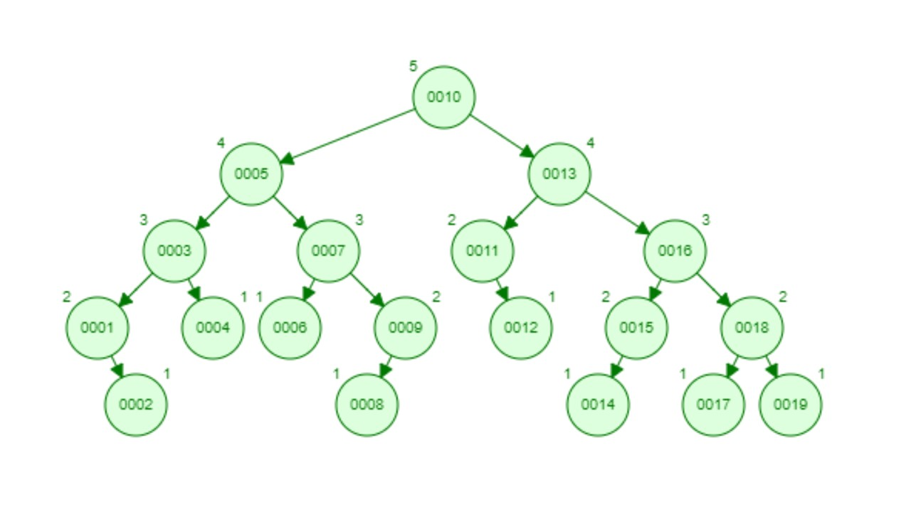

AVL Tree yang terbentuk kira-kira akan seperti ini.
Semua duplikat akan diabaikan saat menginput data ke tree.

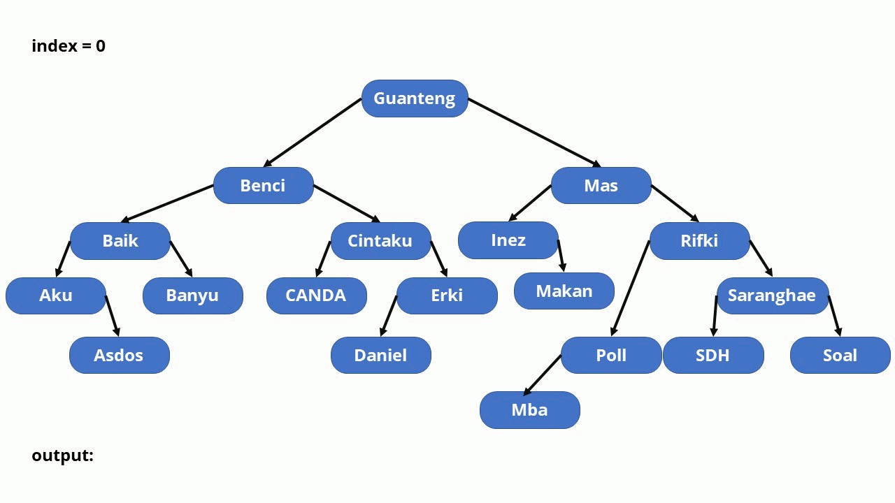

Mengeluarkan isi tree dan numbering dengan traversal inorder.


Mengeluarkan isi tree dengan aksesori `--<3--` dengan traversal inorder.

Output:

```c
1. Aku
2. Asdos
3. Baik
4. Banyu
5. Benci
6. CANDA
7. Cintaku
8. Daniel
9. Erki
10. Guanteng
11. Inez
12. Makan
13. Mas
14. Mba
15. Poll
16. Rifki
17. SDH
18. Saranghae
19. Soal
Aku--<3--Asdos--<3--Baik--<3--Banyu--<3--Benci--<3--CANDA--<3--Cintaku--<3--Daniel--<3--Erki--<3--Guanteng--<3--Inez--<3--Makan--<3--Mas--<3--Mba--<3--Poll--<3--Rifki--<3--SDH--<3--Saranghae--<3--Soal
```

## MALUR NGULI

### Verdict

WA

#### Bukti

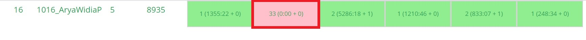

### Penjelasan Soal

Diminta untuk membuat program yang dapat memasukkan bilangan `x` ke AVL Tree saat diberi command `insert x` dan mencetak jumlah dari node yang ada dalam satu kolom, dari kiri ke kanan saat diberi perintah `print`.

### Penjelasan Solusi

Soal ini diselesaikan dengan menggunakan operasi mirip traversal, yang terdapat pada fungsi `sumHD`. Node root dianggap sebagai kolom `0`, sedangkan kolom di sebelah kirinya dianggap negatif dan kolom sebelah kanannya dianggap positif (didasarkan pada ide jarak node dari node root). Data kolom ini disimpan dalam variabel `int hd` dalam parameter fungsi `sumHD`. Untuk menyimpan penjumlahan dari node yang sekolom, digunakan array (dalam kode digunakan struktur `spArr`, dengan member `array of int` [untuk menyimpan bilangan] dan `int size` [untuk mengetahui banyaknya kolom]). Karena nilai index dari array tidak dapat negatif, node yang berada pada kolom negatif akan dimasukkan ke `sumNeg->arr`, sedangkan yang positif akan dimasukkan ke `sumPos->arr`. (dipisah)

Operasi yang dilakukan di dalam fungsi `sumHD` adalah

- Jika mentraverse ke kiri node, hd akan dikurangi `1`. Jika mentraverse ke kanan, hd akan ditambah `1`.
- Lalu, untuk dapat menjumlahkan anggota kolom, diberikan if else. Jika nilai `hd < 0`, maka nilai node tersebut dimasukkan ke `sumNeg->arr` dengan indexnya adalah nilai absolut dari hd. Selain nilai itu, nilai node akan dimasukkan ke `sumPos->arr` dengan indexnya adalah nilai dari hd.

Di dalam fungsi `main`:
Pertama, inisialisasi sebuah AVL Tree bernama myAVL. Lalu, buat spArr bernama `neg` dan `pos`; integer `N` (mengambil nilai test case) dan `X` (bilangan yang ingin dimasukkan ke AVL Tree); dan array of char `A` (untuk mengambil command).
Lalu, ambil input untuk `N`. Selanjutnya, lakukan loop sebanyak `N` kali. Setiap iterasi, terjadi pengambilan input `A` dan mengevaluasi nilai `A`:

- Jika `A` adalah `insert` (`!strcmp(A, "insert")`), minta input untuk `X`, dan masukkan nilai `X` ke myAVL (`avl_insert(&myAVL, X);`)
- Jika `A` adalah `print` (`!strcmp(A, "print")`):
  - Jika myAVL kosong, cetak `0` dan lanjut ke iterasi berikutnya.
  - Jika tidak, inisialisasi `neg` dan `pos` dengan initSpArr agar array di dalam struct tersebut semua anggotanya bernilai `0`. Lalu, panggil fungsi `sumHD` dengan mengirimkan parameter root dari myAVL, alamat `neg`, alamat `pos`, dan `0`.
  Lalu, lakukan loop untuk menghitung banyak anggota dalam arr dengan menghentikan loop saat nilai dari anggota arr adalah nol (untuk `neg`, pengecekan index dimulai dari `1` (kolom `-1`) sedangkan untuk `pos` dimulai dari `0` (kolom `0`)). Kemudian, cetak nilai dari array dari `neg` secara terbalik (dari index yang terbesar == kolom paling kiri). Setelahnya, cetak nilai dari array dari `pos` dari index terkecil ke terbesar.
- Jika `A` bukan kedua nilai di atas, lewati iterasi.

### Visualisasi Solusi

Untuk mempermudah visualisasi solusi dari permasalahan MALUR NGULI, digunakan sample input berikut:

```c
9
insert 20
insert 10
insert 15
insert 9
insert 6
insert 25
insert 24
insert 26
print
```

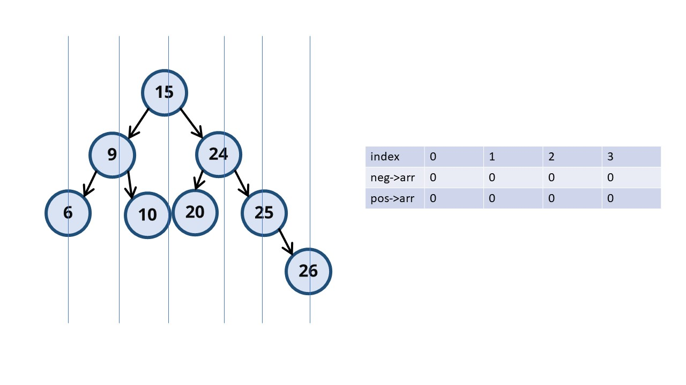

Pertama, buat tree sesuai banyak input `insert` yang diberikan.

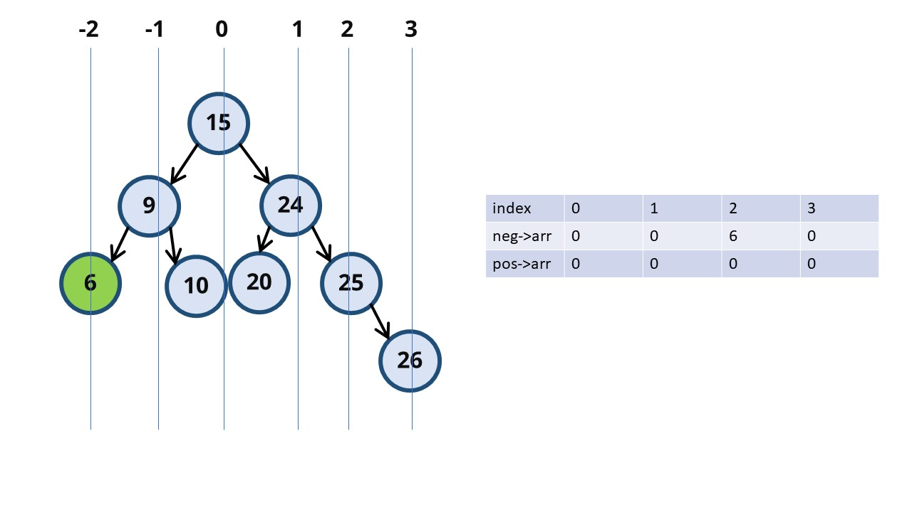

Telusur ke node paling kiri, sehingga nilai `hd = 0-1-1=-2`. Tambahkan nilai node (6) ke `neg->arr` index 2.


Lanjut ke node parentnya, nilai `hd = 0-1 = -1`, sehingga tambahkan nilai node (9) ke `neg->arr` index 1.

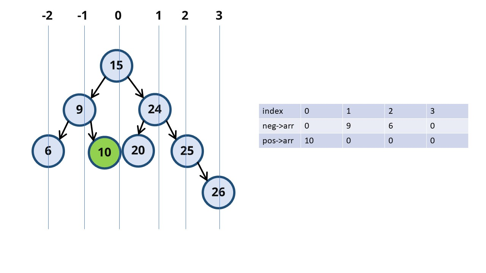

Lanjut ke node sebelah kanan dari parent, nilai `hd = 0-1+1 = 0`, sehingga tambahkan nilai node (10) ke `pos->arr` index 0.

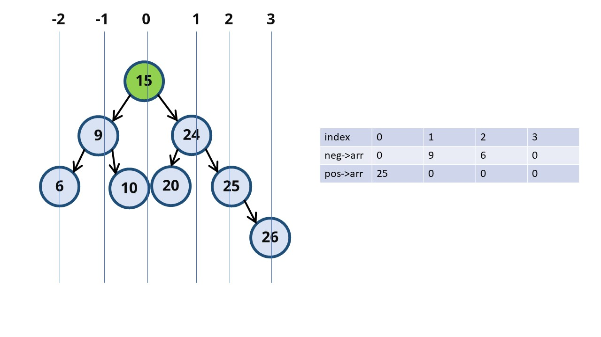

Lanjut ke node parentnya, nilai `hd = 0`, sehingga tambahkan nilai node (15) ke `pos->arr` index 0.


Lanjut ke node terkiri dari sebelah kanan parent, nilai `hd = 0+1-1 = 0`, sehingga tambahkan nilai node (20) ke `pos->arr` index 0.

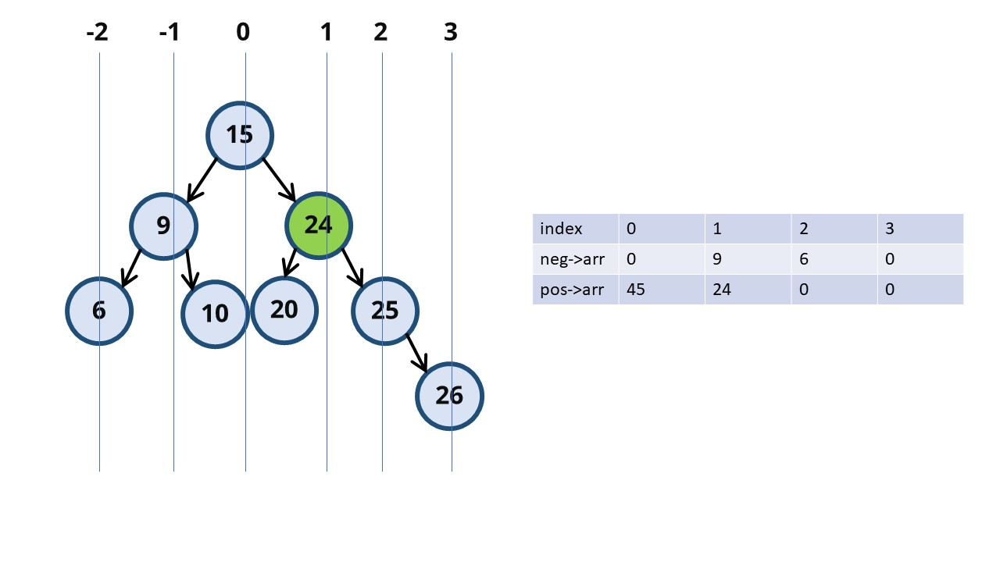

Lanjut ke node parentnya, nilai `hd = 0+1 = 1`, sehingga tambahkan nilai node (24) ke `pos->arr` index 1.

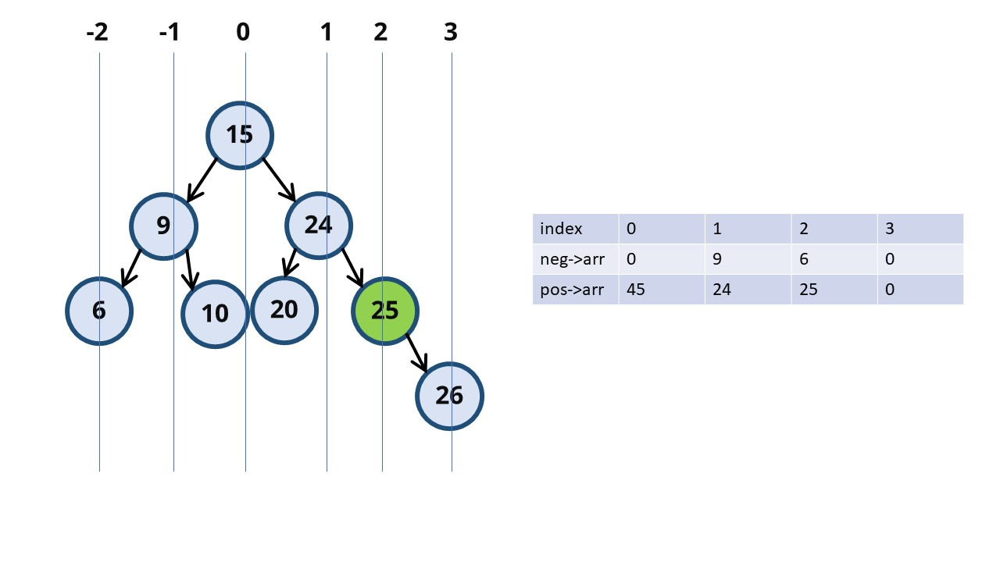

Lanjut ke node sebelah kanan dari parent, nilai `hd = 0+1+1 = 2`, sehingga tambahkan nilai node (25) ke `pos->arr` index 2.

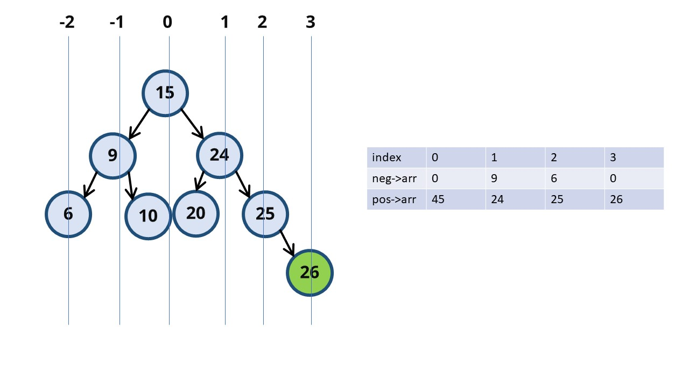

Lanjut ke node sebelah kanan dari parent, nilai `hd = 0+1+1+1 = 3`, sehingga tambahkan nilai node (26) ke `pos->arr` index 3.

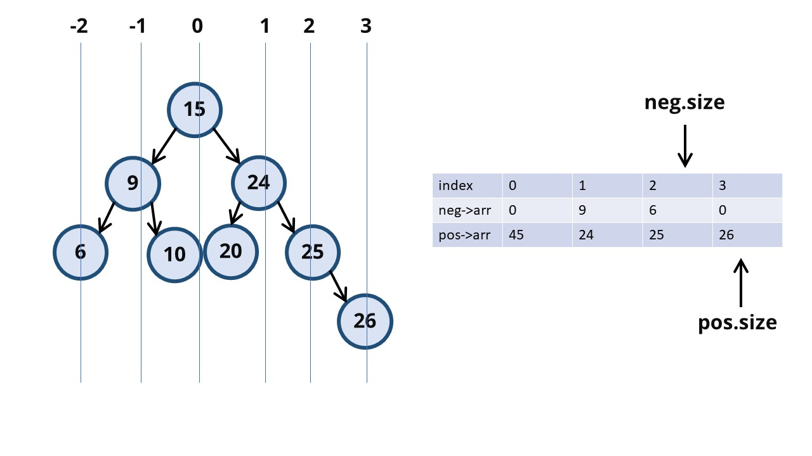

Terakhir, print `neg->arr` dari index `neg.size` ke index 1 (terbalik), lalu print `pos->arr` dari index 0 ke index `pos.size`

Output:

```c
6 9 45 24 25 26 
```
